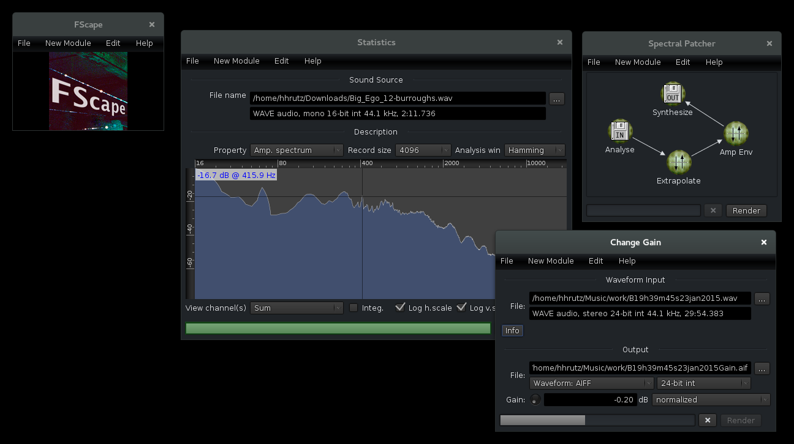

# FScape

## statement

FScape is a standalone, cross-platform audio rendering software.

FScape is (C)opyright 2001&ndash;2017 by Hanns Holger Rutz. All rights reserved.

This program is free software; you can redistribute it and/or modify it under the terms of the [GNU General Public License](http://github.com/Sciss/FScape/blob/master/LICENSE) v3+.

This program is distributed in the hope that it will be useful, but _without any warranty_ without even the implied warranty of _merchantability_ or _fitness for a particular purpose_. See the GNU General Public License for more details.

To contact the author, send an email to `contact at sciss.de`. For project status, API and current version visit [github.com/Sciss/FScape](http://github.com/Sciss/FScape).

FScape is winner of the 2014 [LoMus award](http://concours.afim-asso.org/) (ex-aequo) by the Association Française d’Informatique Musicale (AFIM).

## downloading

A binary version of FScape for all platforms is provided through [GitHub Releases](https://github.com/Sciss/FScape/releases/latest).

## running

In the binary distribution, you should use the shell scripts `bin/fscape` (Linux, OS X) or `bin/fscape.bat` (Windows) to start the application. If you have installed the Debian package, `fscape` should be on your path and available as a desktop icon in your desktop environment.

## compiling

FScape now builds with [sbt](http://www.scala-sbt.org/) 0.13. You can use the provided `sbt` shell script if you do not want to install sbt on your system.

 - to compile: `sbt compile`
 - to package: `sbt package`
 - to run: `sbt run`
 - to make a standalone jar: `sbt assembly`
 
The release bundles are produced with tasks `universal:packageBin` and `debian:packageBin`.

## contributing

Please see the file [CONTRIBUTING.md](CONTRIBUTING.md) for details.

## source code distribution

FScape's GPL'ed source code is made available through [github.com/Sciss/FScape](http://github.com/Sciss/FScape).

For OSC communication, FScape uses the NetUtil library, which is licensed under the GNU Lesser General Public License (LGPL). The source code is available from [github.com/Sciss/NetUtil](https://github.com/Sciss/NetUtil).

FScape uses the ScissLib library which is licensed under the GNU General Public License, source code provided through [github.com/Sciss/ScissLib](https://github.com/Sciss/ScissLib).

FScape is bundled with the Web Look-and-feel licensed under the GNU General Public License, source code provided through [github.com/mgarin/weblaf](https://github.com/mgarin/weblaf).

The libraries [Desktop](https://github.com/Sciss/Desktop), [FileUtil](https://github.com/Sciss/FileUtil) and [RaphaelIcons](https://github.com/Sciss/RaphaelIcons) are covered by the LGPL.

The [sbt build script](https://github.com/paulp/sbt-extras) by Paul Phillips is included which is licensed under the BSD license.

## documentation

A basic quick start guide starts from `help/index.html`. This help is also accessible from the help menu within the application. For each of the processing modules, help is available via Help &gt; Module Documentation.

A short screencast is available on [Vimeo](https://vimeo.com/26509124).

For help, visit the Gitter channel.
